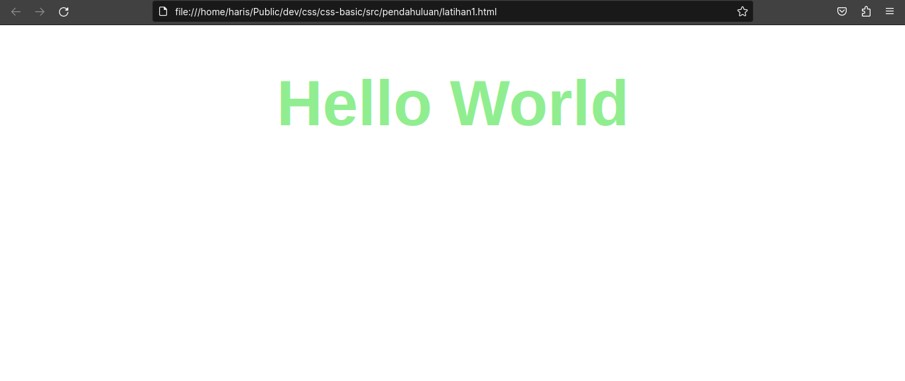

# CSS Basic

## Table Of Contents

- [Pendahuluan](#pendahuluan)

## Pendahuluan

CSS adalah singkatan dari Cascading Style Sheet, secara definisi menurut [w3.org](#https://www.w3.org/style/CSS) yaitu mekanisme sederhana yang mengatur gaya / style (cth: warna, ukuran, posisi, dll) pada halaman web.

**Sebelum Ada CSS**

- Sebelum ada css kita meng-style sebuah halaman dengan menggunakan tag
- seperti `<font></font>` untuk mengubah gaya font, dan lain-lain.

Contoh kita meng-style kata Hello World seperti berikut:



kita membutuhkan kode html seperti ini:

```html
<html>
  <head>
    <title>Sebelum ada CSS</title>
  </head>
  <body>
    <font size="+6" color="lightgreen" face="sans-serif">
      <center>
        <h1>Hello World</h1>
      </center>
    </font>
  </body>
</html>
```

**Dengan CSS**

- Betapa ribetnya jika kita membuat style tanpa adanya css
- Hal itu akan terjadi duplikasi kode yang begitu banyak
- Dengan Menggunakan CSS, maka kode yang kita buat tidak terlalu banyak
- Contoh meng-style Hello World menggunakan CSS

**Kode CSS:**

```html
<!-- HTML -->
<h1>Hello World</h1>
```

```css
/* CSS */
h1 {
    font-size: 120px;
    font-family: arial;
    color: lightgreen;
    text-align-center;
}
```

**Hasilnya akan sama:**


**Jadi, Cascading Style Sheet (CSS) adalah:**

- Aturan yang digunakan untuk menampilkan elemen / tag HTML
- Dibuat terpisah antara CSS dan HTML
- Bertujuan untuk memisahkan konten dan style
- 1 CSS dapat digunakan untuk banyak halaman HTML
- 1 halaman HTML dapat terlihat berbeda jika menggunakan CSS yang berbeda pula

> Source Material from Web Programming Unpas
